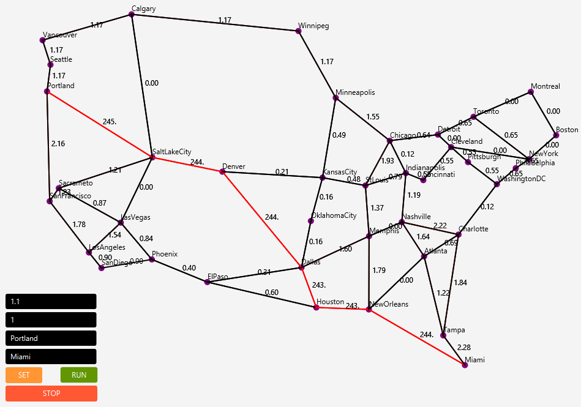

# Ant Colony Algorithm 
## Algorytm mrówkowy z wizualizacją

Projekt zrealizowany w ramach przedmiotu Podstawy Sztucznej Inteligencji. Dla sieci janos-us-ca pochodzącej z SNDlib ustala optymalną ścieżkę 
według ustalonej metryki, a także podejmuje się wizualizacji sieci w czasie rzeczywistym.

## Uruchomienie

Zalecamy korzystanie z IntelliJ IDE. W celu kompilacji i uruchomienia projektu należy:

#### JDK 8
 - W strukturze projektu, w zakładce 'biblioteki' załączyć'sndlib/sndlib.jar', a także zawartość folderu 'sndlib/lib'

#### JDK 10+
 - Pobrać i wypakować bibliotekę JavaFX np. z: https://gluonhq.com/products/javafx/
 - Do struktur projektu w zakładce biblioteki dołączyć  '%ścieżka_do_folderu_JavaFX/lib'
 - W tej samej zakładce załączyć również załączyć'sndlib/sndlib.jar', a także zawartość folderu 'sndlib/lib'
 - W konfiguracji Debugowania/Uruchomienia w polu VM Options dołączyć argumenty:
 >> --module-path ścieżka_do_folderu_javaFX\lib --add-modules=javafx.controls,javafx.fxml,javafx.media

## Wizualizacja

Przykład uruchomionego algorytmu dla trasy Portland-Miami

